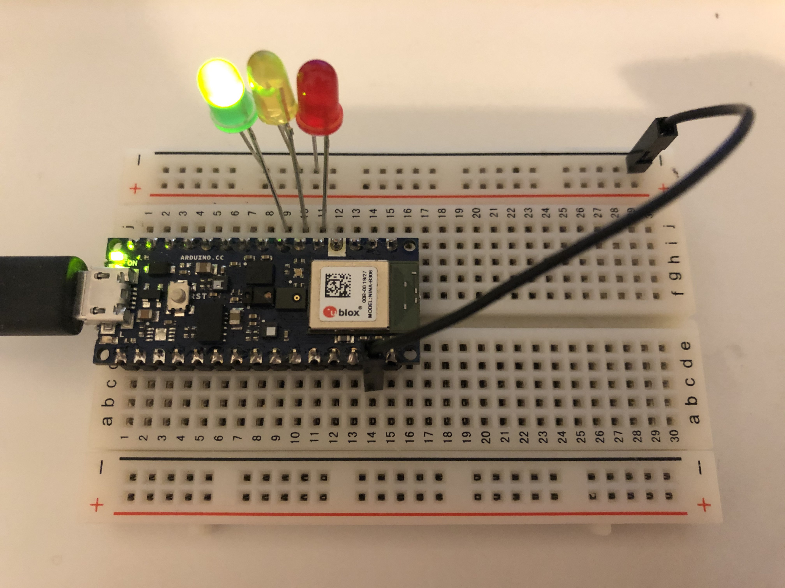

# ABC Gestures Classification
This is a tutorial of training 3 gestures instead of 2(flex, punch) from the [Gesture2Emoji](../GestureToEmoji) workshop. You can follow this tutorial to see how can we train more than 2 gestures classifier. You can also modify it to train any number of gestures you like. But make sure each class are distinct from each other.

## Demo
Classify "A", "B", "C" gestures.
[video](https://youtu.be/7AfUF4RuiZ8)

## How to Run it
A [video]() of how to run this workshop

## 0. What do you need
Arduino Nano 33 BLE Sense (and its USB cable), Laptop

## 1. Circuit
- Connects D2, D3, D4 to three LEDs.


## 2. Collect data
- Open the [IMU_Classifier](https://github.com/yining1023/Machine-Learning-for-Physical-Computing/tree/master/Examples/ABCGestures/ArduinoSketches/IMU_Capture) sketch in Arduino, select the board and port, upload it to your Arduino Nano 33 BLE sense board.
- Open the serial port, start performing gesture "A" for more than 15 times, Arduino will detect the sudden movement and start recording the accelerometer and gyroscope data for 1 second, you should be able to see 119 lines of aX,aY,aZ,gX,gY,gZ numbers in the serial monitor. Copy the output from the serial monitor and save it in a "a.csv" file.
- Clear the serial montior, press the reset button on the board, repeat the process for gesture "B" and "C".
- In the end, we will have 3 .csv files: "a.csv", "b.csv", "b.csv"

## 3. Train the model
Open [this google colab](https://colab.research.google.com/drive/1E2UFGJjddwEp3yKxMF9Fk02D2KACauyn), 
To train our own classes, we need to change the Gesture class.
There are 3 places that we need to make some small changes.
  - 1. Graph Data (optional)
    ```python
    filename = "a.csv" # change the "a.csv" to any of your own filename
    ```
  - 2. Parse and prepare the data
    ```python
    GESTURES = [
      "a",
      "b",
      'c'
    ]
    ```
    Put a list of your gestures here, the same names of your `csv` file
In the end, you should have a `model.h` file that you downloaded from the colab.

## 4. Run the model
Go to Arduino IDE, open this [IMU_Classifier](https://github.com/yining1023/Machine-Learning-for-Physical-Computing/tree/master/Examples/ABCGestures/ArduinoSketches/IMU_Classifier) sketch, replace its `model.h` file to the file that we got from the google colab.

Inside of the sketch, change the list of gestures as well:
```
// array to map gesture index to a name
const char* GESTURES[] = {
  "a",
  "b",
  "c"
};
```
Select the port and board, upload this sketch, open the serial monitor. Perform all gestures, you will see the results in the serial monitor.
This skecth will also light up LEDs at D2,3,4 pins when different classes are recognized. Watch the above demo video to learn more.
