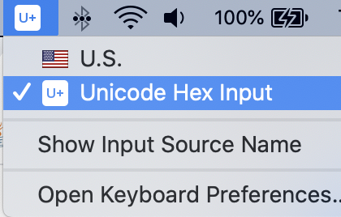
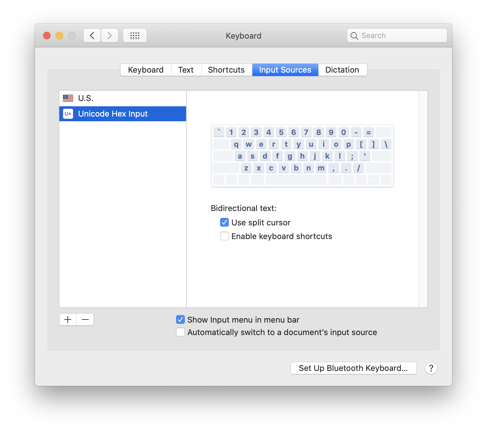
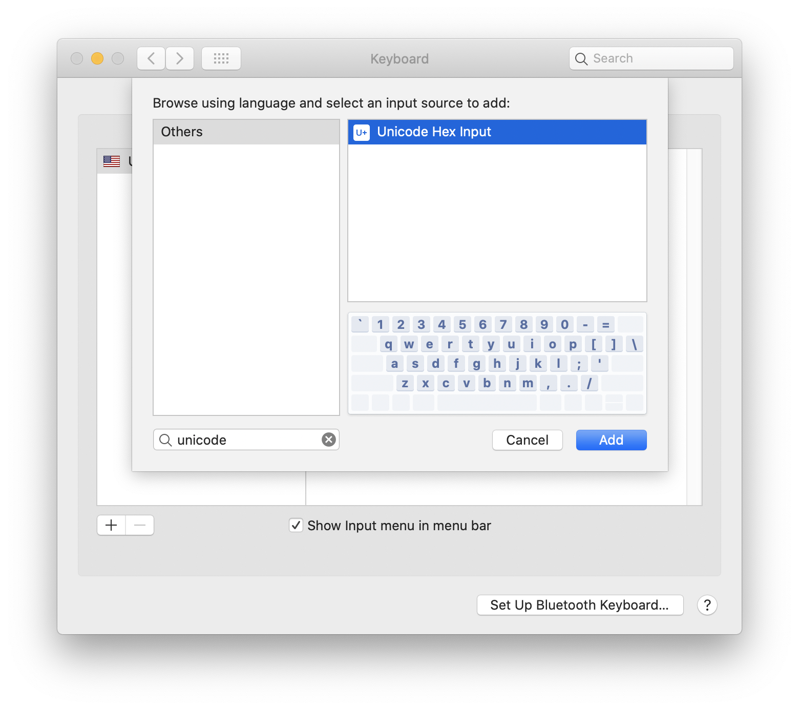

# Exercise 7: Gesture Controlled USB Emoji Keyboard

The Emoji_Button example, __ArduinoSketchs/Emoji_Button/Emoji_Button.ino__, shows how to create a USB keyboard that prints and emoji character. (This only works on Linux and macos, so if you're running Windows, find a friend to work on this exercise.)

Try combining the Emoji_Button example with the IMU_Classifier sketch to create an gesture controlled emoji keyboard. 👊

Next [Exercise 8: Next Steps](exercise8.md)

The Emoji_Button example needs a button connected to pin 3 and GND.

Go to a text editor like google doc, select Unicode Hex Input has the keyboard input source:

You can install the unicode keyboard like this:

