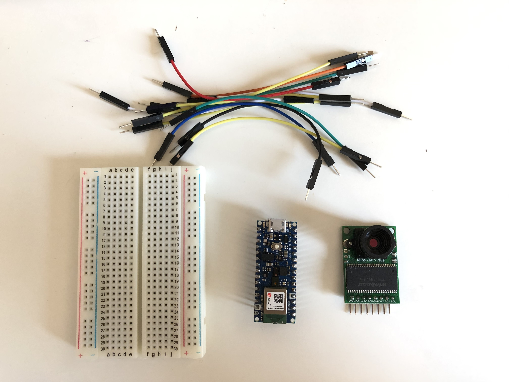
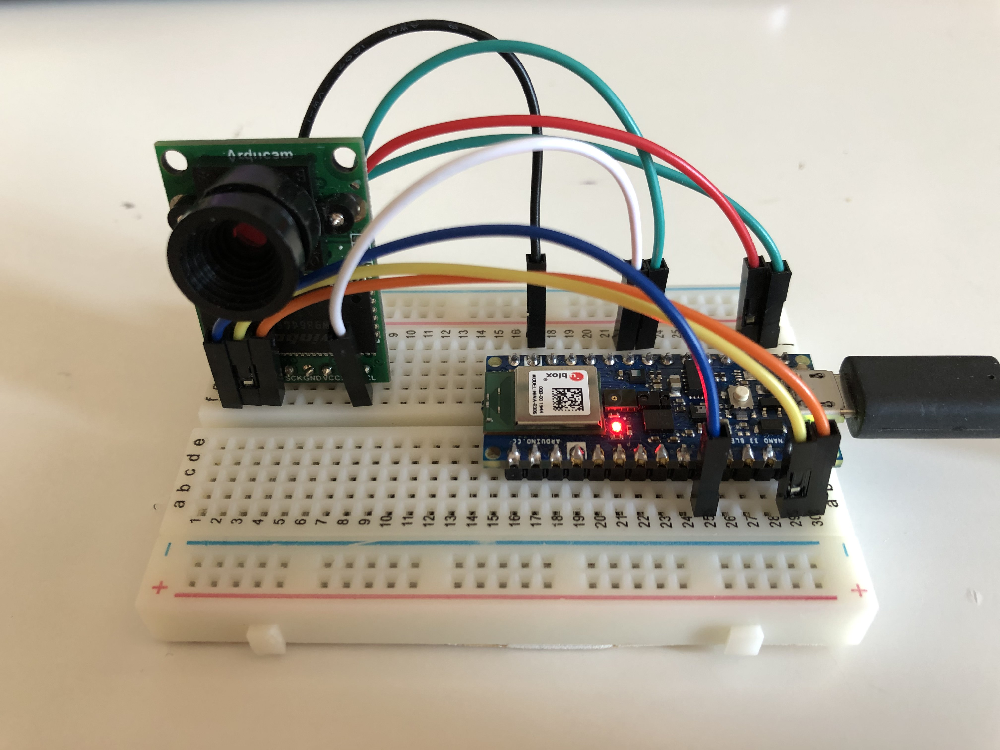
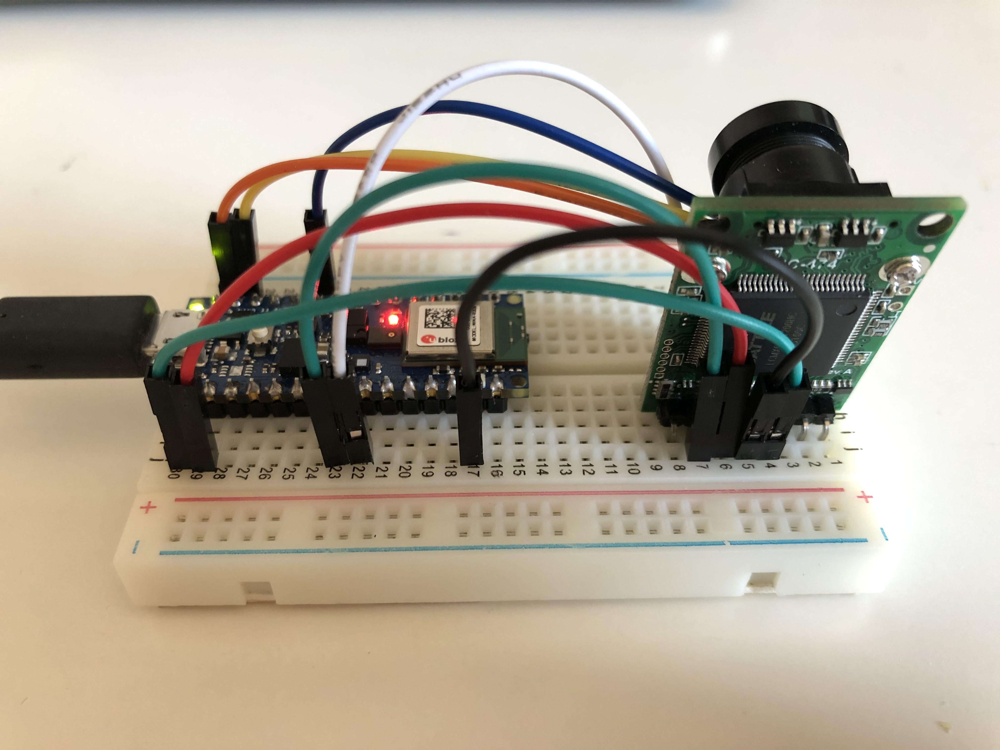

## Demo
[video](https://youtu.be/k-hnPUr5OnU)

## How to run it
[video]()

## Parts


## Circuit:


## Other tutorial
See also [Person Detection with TensorFlow and Arduino](https://create.arduino.cc/projecthub/little_lookout/person-detection-with-tensorflow-and-arduino-47ae01) on Arduino project hub

Circuit wiring diagram


# Forked from [tflite examples](https://github.com/tensorflow/tensorflow/tree/master/tensorflow/lite/micro/examples/person_detection)

# Person detection example

This example shows how you can use Tensorflow Lite to run a 250 kilobyte neural
network to recognize people in images captured by a camera.  It is designed to
run on systems with small amounts of memory such as microcontrollers and DSPs.

## Table of contents
-   [Getting started](#getting-started)
-   [Running on Arduino](#running-on-arduino)

## Running on Arduino

The following instructions will help you build and deploy this sample
to [Arduino](https://www.arduino.cc/) devices.

The sample has been tested with the following device:

- [Arduino Nano 33 BLE Sense](https://store.arduino.cc/usa/nano-33-ble-sense-with-headers)

You will also need the following camera module:

- [Arducam Mini 2MP Plus](https://www.amazon.com/Arducam-Module-Megapixels-Arduino-Mega2560/dp/B012UXNDOY)

### Hardware

Connect the Arducam pins as follows:

|Arducam pin name|Arduino pin name|
|----------------|----------------|
|CS|D7 (unlabelled, immediately to the right of D6)|
|MOSI|D11|
|MISO|D12|
|SCK|D13|
|GND|GND (either pin marked GND is fine)|
|VCC|3.3 V|
|SDA|A4|
|SCL|A5|

### Install the Arduino_TensorFlowLite library

Download the current nightly build of the library:
[person_detection.zip](https://storage.googleapis.com/tensorflow-nightly/github/tensorflow/tensorflow/lite/micro/tools/make/gen/arduino_x86_64/prj/person_detection/tensorflow_lite.zip)

This example application is included as part of the official TensorFlow Lite
Arduino library. To install it, open the Arduino library manager in
`Tools -> Manage Libraries...` and search for `Arduino_TensorFlowLite`.

### Install other libraries

In addition to the TensorFlow library, you'll also need to install two
libraries:

* The Arducam library, so our code can interface with the hardware
* The JPEGDecoder library, so we can decode JPEG-encoded images

The Arducam Arduino library is available from GitHub at
[https://github.com/ArduCAM/Arduino](https://github.com/ArduCAM/Arduino).
To install it, download or clone the repository. Next, copy its `ArduCAM`
subdirectory into your `Arduino/libraries` directory. To find this directory on
your machine, check the *Sketchbook location* in the Arduino IDE's
*Preferences* window.

After downloading the library, you'll need to edit one of its files to make sure
it is configured for the Arducam Mini 2MP Plus. To do so, open the following
file:

```
Arduino/libraries/ArduCAM/memorysaver.h
```

You'll see a bunch of `#define` statements listed. Make sure that they are all
commented out, except for `#define OV2640_MINI_2MP_PLUS`, as so:

```
//Step 1: select the hardware platform, only one at a time
//#define OV2640_MINI_2MP
//#define OV3640_MINI_3MP
//#define OV5642_MINI_5MP
//#define OV5642_MINI_5MP_BIT_ROTATION_FIXED
#define OV2640_MINI_2MP_PLUS
//#define OV5642_MINI_5MP_PLUS
//#define OV5640_MINI_5MP_PLUS
```

Once you save the file, we're done configuring the Arducam library.

Our next step is to install the JPEGDecoder library. We can do this from within
the Arduino IDE. First, go to the *Manage Libraries...* option in the *Tools*
menu and search for `JPEGDecoder`. You should install version _1.8.0_ of the
library.

Once the library has installed, we'll need to configure it to disable some
optional components that are not compatible with the Arduino Nano 33 BLE Sense.
Open the following file:

```
Arduino/libraries/JPEGDecoder/src/User_Config.h
```

Make sure that both `#define LOAD_SD_LIBRARY` and `#define LOAD_SDFAT_LIBRARY`
are commented out, as shown in this excerpt from the file:

```c++
// Comment out the next #defines if you are not using an SD Card to store the JPEGs
// Commenting out the line is NOT essential but will save some FLASH space if
// SD Card access is not needed. Note: use of SdFat is currently untested!

//#define LOAD_SD_LIBRARY // Default SD Card library
//#define LOAD_SDFAT_LIBRARY // Use SdFat library instead, so SD Card SPI can be bit bashed
```

Once you've saved the file, you are done installing libraries.

### Load and run the example

Go to `File -> Examples`. You should see an
example near the bottom of the list named `TensorFlowLite`. Select
it and click `person_detection` to load the example. Connect your device, then
build and upload the example.

To test the camera, start by pointing the device's camera at something that is
definitely not a person, or just covering it up. The next time the blue LED
flashes, the device will capture a frame from the camera and begin to run
inference. Since the vision model we are using for person detection is
relatively large, it takes a long time to run inference—around 19 seconds at the
time of writing, though it's possible TensorFlow Lite has gotten faster since
then.

After 19 seconds or so, the inference result will be translated into another LED
being lit. Since you pointed the camera at something that isn't a person, the
red LED should light up.

Now, try pointing the device's camera at yourself! The next time the blue LED
flashes, the device will capture another image and begin to run inference. After
19 seconds, the green LED should light up!

Remember, image data is captured as a snapshot before each inference, whenever
the blue LED flashes. Whatever the camera is pointed at during that moment is
what will be fed into the model. It doesn't matter where the camera is pointed
until the next time an image is captured, when the blue LED will flash again.

If you're getting seemingly incorrect results, make sure you are in an
environment with good lighting. You should also make sure that the camera is
oriented correctly, with the pins pointing downwards, so that the images it
captures are the right way up—the model was not trained to recognize upside-down
people! In addition, it's good to remember that this is a tiny model, which
trades accuracy for small size. It works very well, but it isn't accurate 100%
of the time.

We can also see the results of inference via the Arduino Serial Monitor. To do
this, open the *Serial Monitor* from the *Tools* menu. You'll see a detailed
log of what is happening while our application runs. It's also interesting to
check the *Show timestamp* box, so you can see how long each part of the process
takes:

```
14:17:50.714 -> Starting capture
14:17:50.714 -> Image captured
14:17:50.784 -> Reading 3080 bytes from ArduCAM
14:17:50.887 -> Finished reading
14:17:50.887 -> Decoding JPEG and converting to greyscale
14:17:51.074 -> Image decoded and processed
14:18:09.710 -> Person score: 246 No person score: 66
```

From the log, we can see that it took around 170 ms to capture and read the
image data from the camera module, 180 ms to decode the JPEG and convert it to
greyscale, and 18.6 seconds to run inference.
