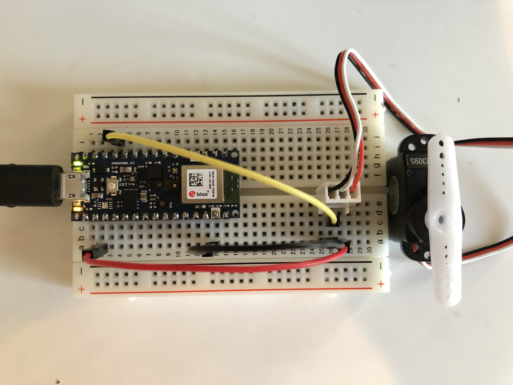
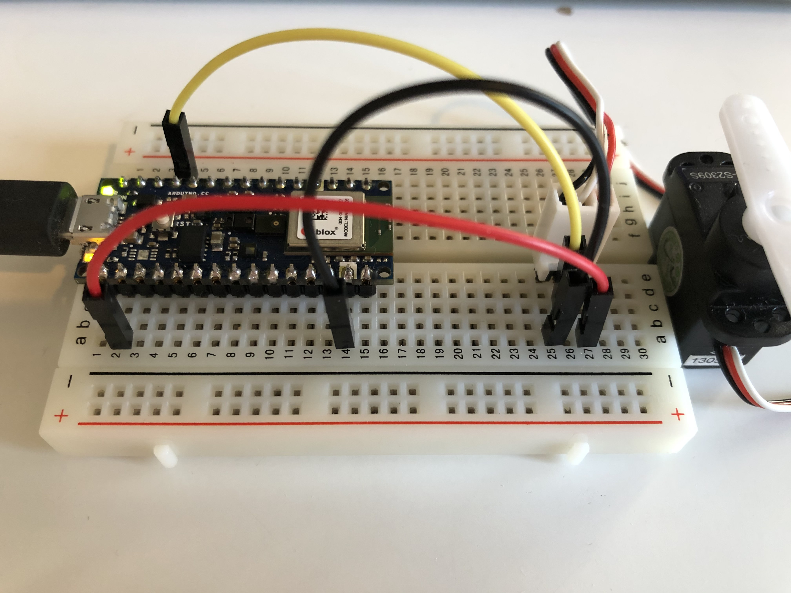

# How to connect a servo motor with Arduino Nano 33 BLE (Sense)

## Demo
This is a [video](https://youtu.be/1JK84QPrm5s) of Arduino Nano 33 BLE Sense on the [Sweep example](https://www.arduino.cc/en/Tutorial/Sweep) from [Servo library](https://www.arduino.cc/en/Reference/Servo)

## Ciruits

## Sweep example
Read more about the Servo motor Sweep example [here](https://www.arduino.cc/en/Tutorial/Sweep)

## Steps
1. Connect the circuit, make sure to connect Arduino's D9 pin to the servo pulse pin. This board is 3.3v, unlike the diagram below, connect 3.3V to the power pin of the servo.

2. Open Arduino IDE, install the latest version of the Servo library, you can search for the library under "Tools - Manage Libraries". Make sure you are using the latest version of the library, the library was updated to support this board.

3. Open to Sweep example, go to "Files - Examples - Servo - Sweep"

4. Select the right board and port, and upload the sketch to your board, then you are good to go. You should be able to see the servo moves like the demo video above.
