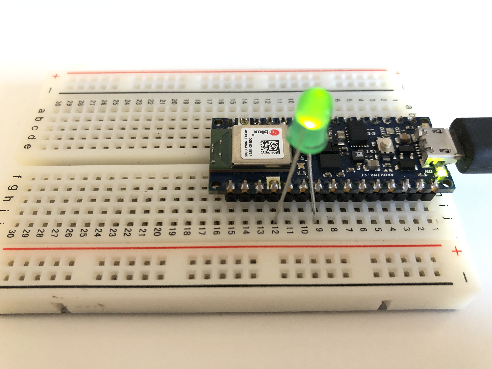

# Communicate with Arduino Nano BLE / loT board through Bluetooth LE

## Demo / How to run it
[vide]()

## Circuit

## Arduino code
[code](https://github.com/yining1023/Machine-Learning-for-Physical-Computing/tree/master/Examples/p5ble/p5ble-arduino)

## p5 sketch
https://editor.p5js.org/yining/sketches/trVjIkaDM
