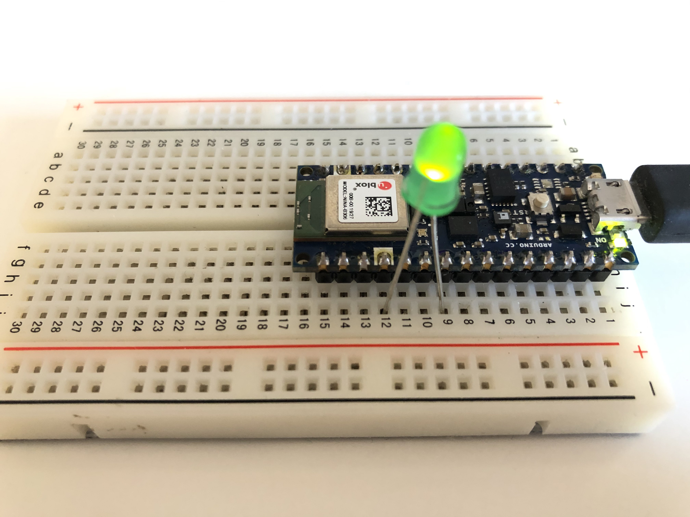

# Communicate with Arduino Nano BLE / loT board through Bluetooth LE

[p5ble.js](https://itpnyu.github.io/p5ble-website/docs/write-one-char-callback) Write to one characteristic

## Demo / How to run it
[vidoe](https://www.loom.com/share/2e3112daa4f6441dbf0eea188cf66c20)

## Circuit

## Arduino code
[code](https://github.com/yining1023/Machine-Learning-for-Physical-Computing/tree/master/Examples/p5ble/p5ble-arduino)

## p5 sketch
https://editor.p5js.org/yining/sketches/trVjIkaDM
